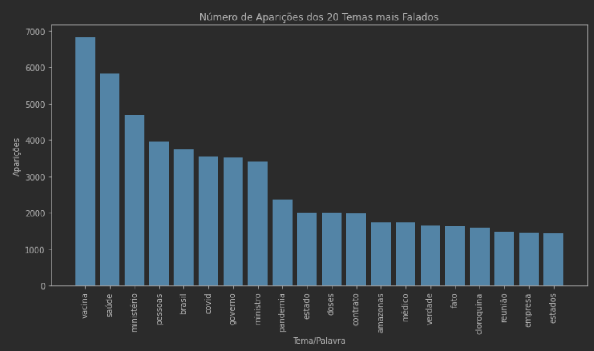
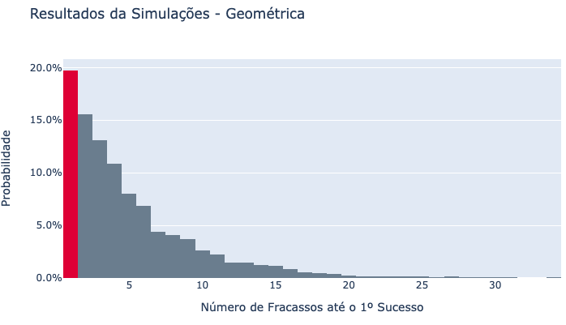
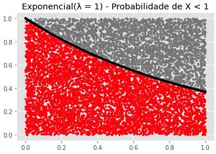
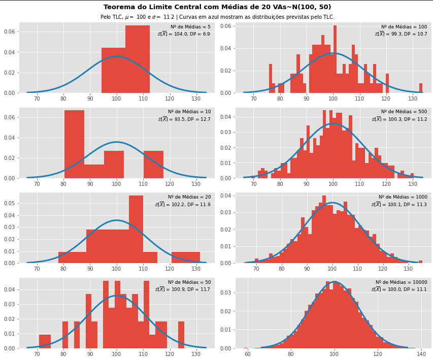
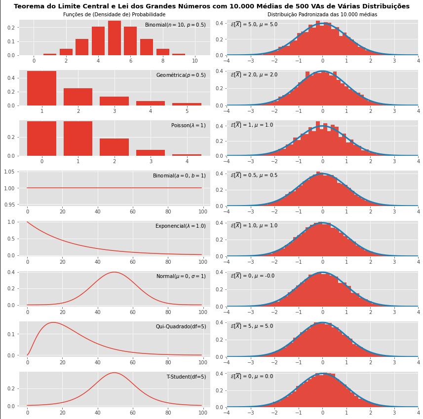
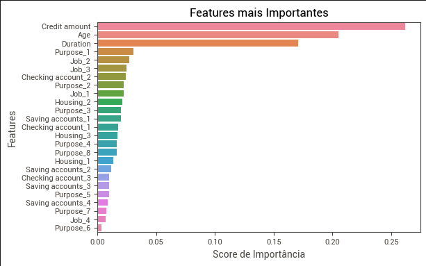

# Projetos Pessoais de Machine Learning e Estatística

Repositório para abrigar alguns projetos pessoais feitos no intuito de aprender um pouco sobre Machine Learning, Estatística e outros temas :)

Além desse repositório, tenho um focado em [econometria](https://github.com/vnery5/Econometria).

----

## Projetos

A intenção do repositório é abrigar projetos para aprender alguns conceitos, como:

- [Análise dos discursos das CPIs](https://github.com/vnery5/Projetos/tree/main/Linguagem%20Natural) para analisar os temas mais frequentes tratados na comissão parlamentar que investigou potenciais *misconducts* no combate à pandemia.
- Implementação de uma Random Forest para analisar a [condição de crédito de cidadãos alemãos](https://github.com/vnery5/Projetos_Pessoais/tree/main/RandomForest_Credito);
- Análises descritivas de [estatística](https://github.com/vnery5/Projetos/tree/main/Estat%C3%ADstica), com simulações de MonteCarlo, teoremas e distribuições.
- Análises simples de [otimização](https://github.com/vnery5/Projetos/tree/main/Otimiza%C3%A7%C3%A3o), tentando aplicar um pouco dos conhecimentos de microeconomia.

----

## Imagens

### Análise dos discursos da CPI da Covid

### Distribuições

### Teorema do Limite Central

### Random Forest

